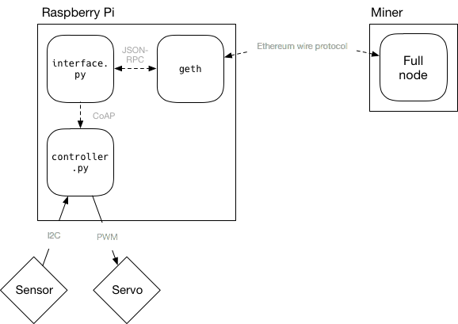

Tutorial 1: Combining blockchains and IoT
=========================================

# Prerequisites

You will need a computer to run a mining node (for private ethereum
network), a Raspberry Pi, suitable sensor and actuator devices to play
with (a temperature sensor and a servo in this example), and all of
these connected to a network they can reach each other.

On the software side you'll need to
install [`geth`](https://ethereum.github.io/go-ethereum/), Python 3,
various python packages required
(see [`requirements.txt`](requirements.txt)), on some or all of the
computers and devices used.

# Overview

The overall system built in this tutorial is shown below. It consists
of a separate "miner" node that we use to construct a private ethereum
network, a Raspberry Pi device, and a sensor and an actuator that are
connected to the RPi.

# Setup

Setup is done in three major steps:

1. Set up private ethereum network, ethereum client in IoT device and
   create a smart contract for controlling the device

2. Set up IoT sensors and actuators (without ethereum)

3. Interface sensors and actuators to the smart contract

Each of these major steps contain further substeps.

> Note that all of the commands that are shown to be run are done here
> interactively. In a real environment you would run these via some
> watchdor or supervisor program that would start them automatically
> on boot, restart if needed and so on.

## Set up ethereum network, client and smart contract

1. Create an ethereum private network (you can use also the public
   one, but that's going to cost you)

2. Set up ethereum full node in the IoT device (without mining)

3. Create an account for the IoT device and set up smart contract for
   it

### Setup private ethereum network with a miner node

See the [`genesis.json`](genesis.json) file for parameters used to
seed the private network. Then run:

	$ geth --datadir data init genesis.json
	$ geth --datadir data --networkid 2018 account new

	   ... <set password as you like> ...

	$ geth --datadir data --networkid 2018 --mine --minerthreads 1

The last command will leave the system running and continously mining
new blocks (these are needed for transactions to complete).

### Set up ethereum full node in the IoT device

You will need to set up the IoT device to be a full node, but to
conserve CPU resources you want to for it **not** to do mining. The
example below uses `data2` in case you want to run this locally
initially.

	$ geth --datadir data2 init genesis.json
	$ geth --datadir data2 --networkid 2018 account new

You will need to look up the `enode://` value from earlier, and
replace the `[::]` part with the public ip address of the "initial"
node.

Then start the console of the IoT node (this also specifies a
different port in case you are running this for testing in the same
machine as the miner node):

	$ geth --datadir data2 --networkid 2018 --rpc --rpcapi personal,eth --bootnodes 'enode://...' --port 30304 console

### Setup smart contract on the IoT device

In the geth console you'll need to create an account **for the IoT
device** and create the contract for it.

	> personal.newAccount()
	... this will ask for a password for the account ...
	> eth.coinbase
	"0x......"
	> miner.start()
	... let it mine a block ...
	> miner.stop()

**SAVE THE `coinbase` ADDRESS** (aka `eth.accounts[0]`), you'll need
it later.

> The block mining step is needed to get some ether into the IoT
> account -- in a realistic scenario it would be sent some from
> another account and not mined, as in the real ethereum network the
> likelihood of the IoT device successfully mining a block is very
> low. However, in this test network mining is a fast operation and we
> can initialize a whole block for the IoT device's account easily
> this way. (You can verify that the IoT account has non-zero balance
> with `eth.getBalance(eth.coinbase)`.)

For the contract you'll need to copy and paste the contents of the two
files (`device_sol_Device.abi` and `device_sol_Device.bin`) into
appropriate places in the following commands (note that you will need
to prefix the .bin file contents with `"0x"` -- or run
the [`wrap.sh`](wrap.sh) script and copy-paste its output):

	> var deviceContract = eth.contract(<copy from the .abi file as is>)
	> var device = deviceContract.new({from: eth.accounts[0], gas:500000, data: "0x<copy from the .bin file as is>"})
	> device.address
	"0x...."

If `device.address` shows `undefined`, wait for a miner to finish
mining a block.

**SAVE THE OUTPUT OF `device.address`!** This is the contract address
that can will be used later as the control endpoint of this IoT
device.

You will need potentially to wait for a while until the contract is
merged into blockchain (e.g. a block is mined with it).

At the end of this step you should have:

* Address of the IoT device's account
* Password for previous
* Address of the device contract

## Set up IoT and sensors

In this tutorial we use CoAP to loosely couple sensor and actuator
code from the ethereum code. This allows us to test and debug sensors
and actuators separately.

The script [`controller.py`](controller.py) contains a fake device
implementation and various defaults that work with it.

First, you'll need to install Python dependencies (in or outside a
virtualenv):

	$ pip install -r requirements.txt

Then you can test the fake hardware interface with:

	$ ./controller.py --fake

(Note: On OS X, you might need to use
`AIOCOAP_CLIENT_TRANSPORT=simple6 ./controller.py --fake
--server-address 127.0.0.1` instead.)

If you install `libcoap-1-0-bin` with the `coap-client` binary, you
can test the controller:

	$ coap-client coap://localhost/temperature

This should show a line in the controller console as well. Then you
can verify that updating the actuator value works too:

	$ coap-client -m PUT -e 100 coap://localhost/actuator

Now you'll need to edit `controller.py` and add code for interfacing
with **your** hardware setup and run it with the `--real` argument.

## Interface device with blockchain

The script [`interface.py`](interface.py) contains code that bridges
the ethereum network to the local hardware. It does this by
periodically checking the CoAP server (e.g. the controller, see above)
for temperature changes and the blockchain for actuation changes. If
temperature has changed, it is pushed to the blockchain and
conversely, if actuation value changes it is PUT into the CoAP server
(controller).

You will need to start the `interface.py` script with the account
address and contract address from earlier step:

	$ ./interface.py 0x...contract... 0x...account...

## Test

There's `contract.py` script which can be used to query temperature
and change actuation from the command line. To query temperature
you'll need only the contract address:

	$ ./contract.py 0x...contract...

To change the actuation value you will also need an account (with
enough wei) and `--set-actuation` argument:

	$ ./contract.py 0x...contract... 0x...account... --set-actuation 0

The actuation value in the controller is (at least in these examples)
between 0 and 100.

# Using Mist and Remix with a custom network

Just as a quick note, if you want to use Mist/Remix with the custom
network you will need to run geth on the desktop machine. The setup is
almost the same as above (init → account new → console) except you
will need to specify an IPC endpoint and use a different port
(otherwise you can get a conflict from mist's default geth). Add the
following options for geth:

	geth --datadir <datadir> --networkid 2018 --bootnodes <your mining enode> --rpc --ipcpath /tmp/geth.ipc --port 30304 console

(you probably want to mine some ethers, so run `miner.start()` on the
console, and after a few successful blocks you can stop it with
`miner.stop()`).

Then you'll need to locate your Mist binary and run it manually with
correct options. For example, on OSX this would be:

	/Applications/Mist.app/Contents/MacOS/Mist --network 2018 --rpc /tmp/geth.ipc

This should now result with a Mist user interface connected to your
private network. You can then use the Remix IDE and run contracts and
trasactions on the test network in the "Injected Web3" environment.
